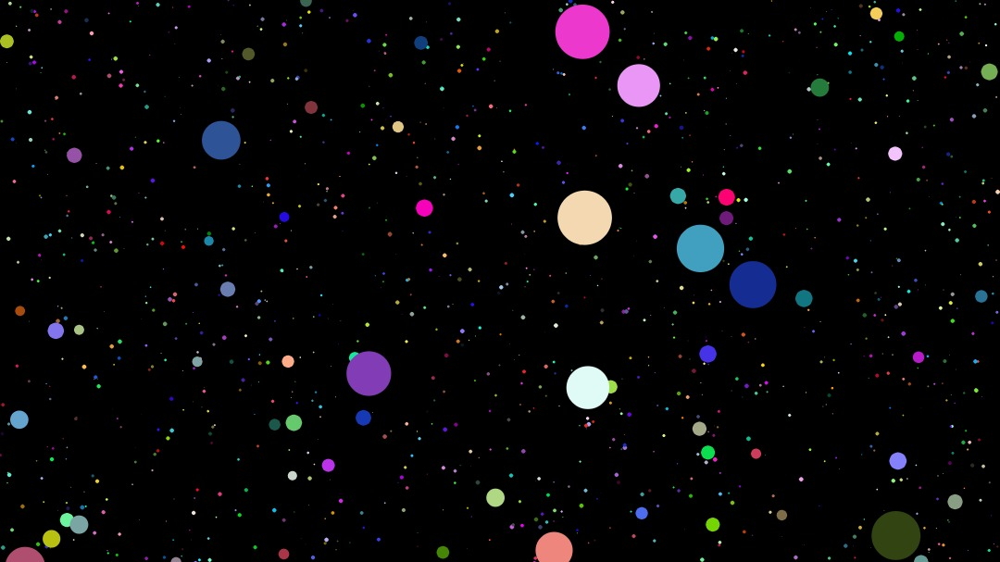

# 👨‍🎨 spebula

Web app that generates random shapes that look a bit like a nebula.

## Usage

Visit this [website](https://spebula.sampoder.com/) to try out the program.

## Technology Used

This website is made using p5.js.

## Contributing
Pull requests are welcome. For major changes, please open an issue first to discuss what you would like to change.

If you find a bug please report it using GitHub Issues.

## License
[MIT](https://choosealicense.com/licenses/mit/)
